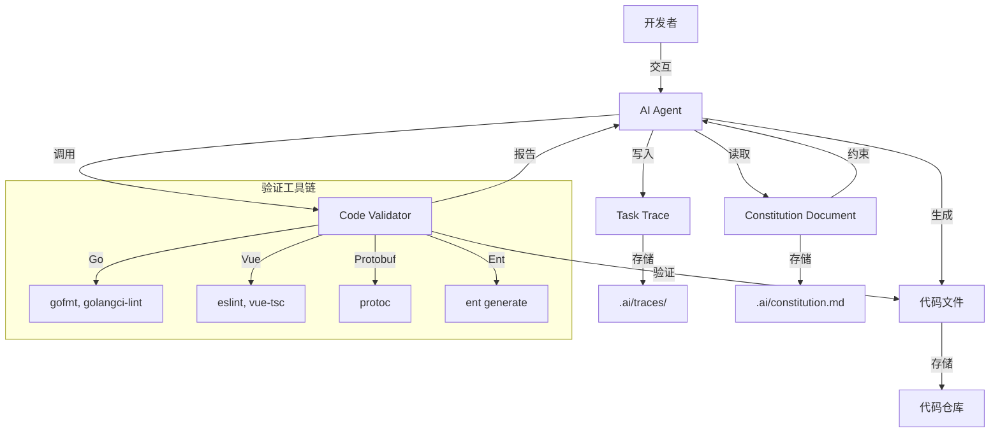
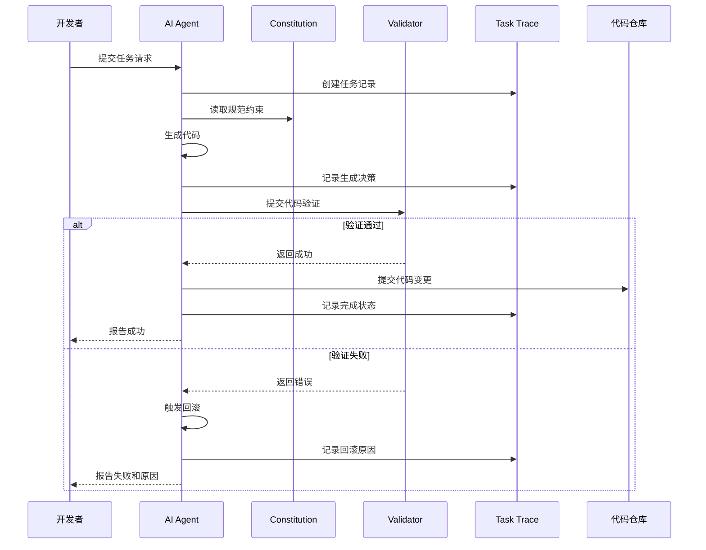
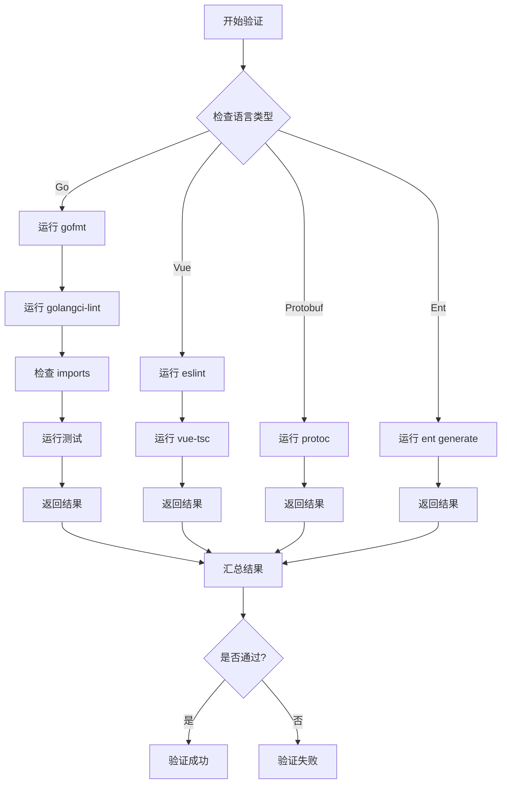
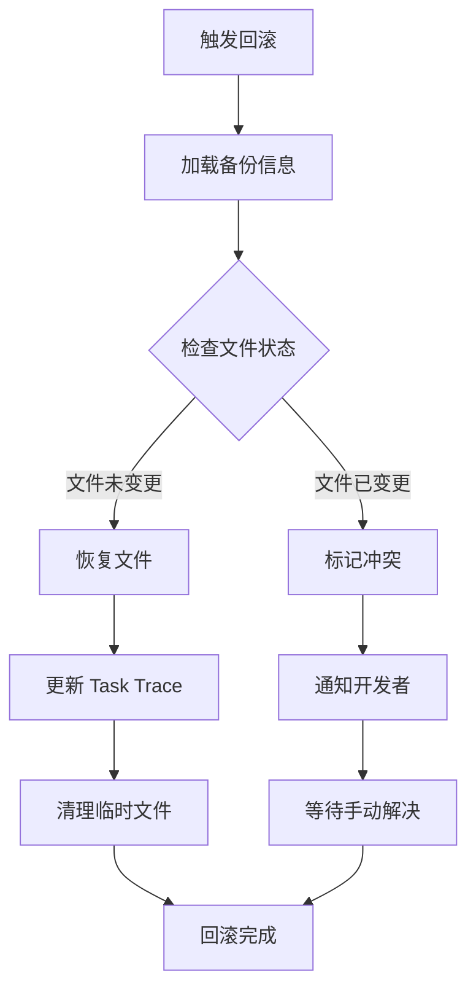
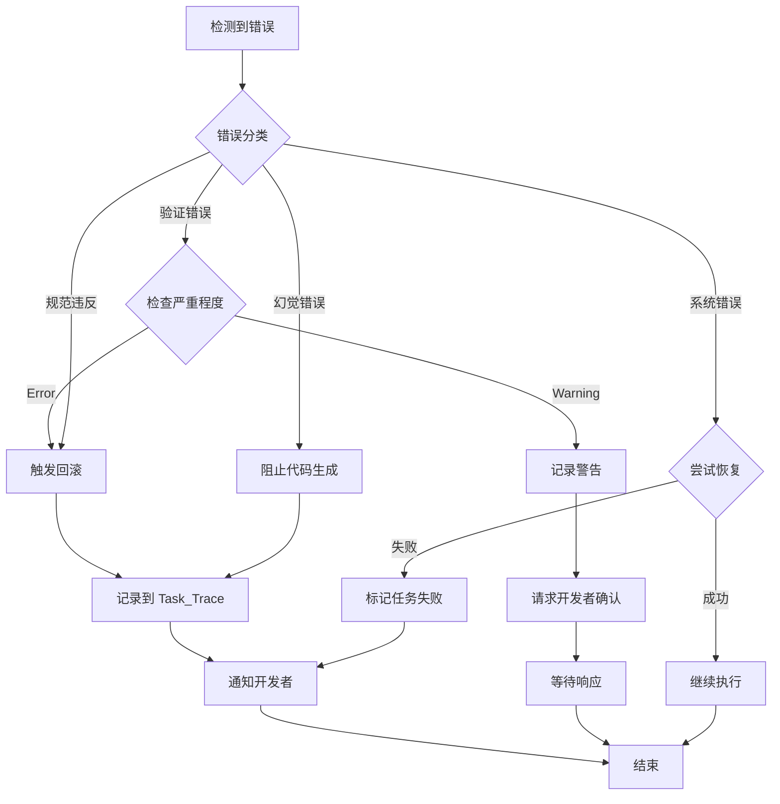

# Design Document: AI Programming Constitution

## Overview

### Purpose

本设计文档定义了 GO + Vue 后台管理框架项目的 AI 编程规范（AI Programming Constitution）的技术实现方案。该规范作为约束 AI 辅助编程行为的核心文档，通过明确的规则、验证机制和留痕系统，确保 AI 生成的代码符合项目架构、编码标准和设计原则，同时防止 AI 模型产生幻觉（hallucination）。

### Scope

本设计涵盖以下核心功能：

1. **规范文档结构**：定义 Constitution 文档的章节组织和内容格式
2. **角色与职责定义**：明确 AI Agent 的角色定位和操作边界
3. **代码生成规范**：Go 后端和 Vue 前端的详细编码规则
4. **架构约束机制**：三层架构、Protobuf/Ent Schema、事件总线等约束
5. **防幻觉验证流程**：代码元素存在性验证和引用检查机制
6. **禁止行为清单**：明确禁止的操作类型和触发条件
7. **任务留痕系统**：完整的任务执行记录和审计追踪
8. **代码验证工具链**：集成 gofmt、golangci-lint、eslint、vue-tsc 等工具
9. **错误处理与回滚**：自动检测违规并回滚的机制
10. **文档同步维护**：代码变更时自动更新相关文档

### Key Design Decisions

1. **文档格式选择 Markdown + YAML**：Constitution 主体使用 Markdown 便于人类阅读，配置部分使用 YAML 便于机器解析
2. **任务留痕采用结构化 JSON**：每个任务生成独立的 JSON 文件，包含完整的操作历史和决策依据
3. **验证工具链集成方式**：通过统一的验证脚本调用各语言的标准工具，而非自研验证器
4. **规范存储位置**：Constitution 文档存放在项目根目录 `.ai/constitution.md`，任务留痕存放在 `.ai/traces/`
5. **版本管理策略**：Constitution 文档纳入 Git 版本控制，通过 PR 流程更新


## Architecture

### System Context



### High-Level Architecture

系统采用文档驱动的约束架构，核心组件包括：

1. **Constitution Document**：规范文档，定义所有约束规则
2. **AI Agent**：执行代码生成任务的 AI 助手
3. **Task Trace System**：任务留痕系统，记录所有操作
4. **Code Validator**：代码验证器，集成多种验证工具
5. **Rollback Mechanism**：回滚机制，处理违规代码

### Directory Structure

```
project-root/
├── .ai/                          # AI 规范和留痕目录
│   ├── constitution.md           # Constitution 主文档
│   ├── config.yaml               # 配置文件（工具路径、验证规则等）
│   ├── traces/                   # 任务留痕目录
│   │   ├── 2024-01-15_task-001.json
│   │   ├── 2024-01-15_task-002.json
│   │   └── ...
│   └── templates/                # 代码模板目录
│       ├── go-service.tmpl
│       ├── vue-component.tmpl
│       └── ...
├── api/                          # API 层（Protobuf 定义）
├── app/                          # 应用层（业务逻辑）
├── pkg/                          # 基础设施层
└── frontend/                     # Vue 前端
```

### Component Interaction Flow




## Components and Interfaces

### 1. Constitution Document Component

**职责**：定义 AI 行为的所有约束规则

**文档结构**：

```markdown
# AI Programming Constitution

## 1. Role Definition (角色定义)
- AI Agent 的角色描述
- 职责范围
- 权限边界

## 2. Code Generation Rules (代码生成规范)
### 2.1 Go Backend Rules
### 2.2 Vue Frontend Rules

## 3. Architecture Constraints (架构约束)
### 3.1 Three-Layer Architecture
### 3.2 Protobuf Schema Rules
### 3.3 Ent Schema Rules
### 3.4 Event Bus Usage

## 4. Anti-Hallucination Rules (防幻觉规则)
### 4.1 Verification Requirements
### 4.2 Reference Checking

## 5. Forbidden Actions (禁止行为)
### 5.1 Architecture Modifications
### 5.2 Security Violations
### 5.3 Dependency Management

## 6. Task Execution Protocol (任务执行协议)
### 6.1 Task Trace Format
### 6.2 Decision Recording

## 7. Validation Requirements (验证要求)
### 7.1 Go Code Validation
### 7.2 Vue Code Validation
### 7.3 Schema Validation

## 8. Rollback Mechanism (回滚机制)
### 8.1 Trigger Conditions
### 8.2 Rollback Procedure

## 9. Documentation Requirements (文档要求)
### 9.1 API Documentation
### 9.2 Component Documentation

## 10. Security and Performance (安全与性能)
### 10.1 Security Rules
### 10.2 Performance Guidelines
```

**配置文件结构** (`.ai/config.yaml`):

```yaml
version: "1.0"

tools:
  go:
    formatter: "gofmt"
    linter: "golangci-lint"
    test_runner: "go test"
  vue:
    linter: "eslint"
    type_checker: "vue-tsc"
    formatter: "prettier"
  protobuf:
    compiler: "protoc"
  ent:
    generator: "ent generate"

validation:
  go:
    run_tests: true
    check_imports: true
    max_complexity: 15
  vue:
    check_types: true
    check_props: true

trace:
  directory: ".ai/traces"
  format: "json"
  retention_days: 90

rollback:
  auto_rollback: true
  backup_before_change: true
```


### 2. Task Trace System Component

**职责**：记录 AI 执行的所有操作和决策过程

**Task Trace JSON Schema**:

```json
{
  "task_id": "string (UUID)",
  "timestamp_start": "ISO8601 datetime",
  "timestamp_end": "ISO8601 datetime",
  "status": "enum: pending|in_progress|completed|failed|rolled_back",
  "task_description": "string",
  "developer_request": "string",
  
  "decisions": [
    {
      "timestamp": "ISO8601 datetime",
      "decision_type": "enum: architecture|implementation|validation",
      "description": "string",
      "rationale": "string",
      "constitution_reference": "string (section reference)"
    }
  ],
  
  "code_changes": [
    {
      "file_path": "string",
      "operation": "enum: create|modify|delete",
      "lines_added": "integer",
      "lines_removed": "integer",
      "summary": "string"
    }
  ],
  
  "validations": [
    {
      "validator": "string (tool name)",
      "timestamp": "ISO8601 datetime",
      "status": "enum: passed|failed",
      "output": "string",
      "errors": ["string"]
    }
  ],
  
  "references": [
    {
      "type": "enum: documentation|example|api_reference",
      "source": "string (file path or URL)",
      "description": "string"
    }
  ],
  
  "rollback": {
    "triggered": "boolean",
    "reason": "string",
    "timestamp": "ISO8601 datetime",
    "restored_files": ["string"]
  }
}
```

**接口**：

```go
// TaskTraceManager 管理任务留痕
type TaskTraceManager interface {
    // CreateTask 创建新任务记录
    CreateTask(description string, developerRequest string) (taskID string, err error)
    
    // RecordDecision 记录决策
    RecordDecision(taskID string, decision Decision) error
    
    // RecordCodeChange 记录代码变更
    RecordCodeChange(taskID string, change CodeChange) error
    
    // RecordValidation 记录验证结果
    RecordValidation(taskID string, validation ValidationResult) error
    
    // AddReference 添加参考资料
    AddReference(taskID string, ref Reference) error
    
    // CompleteTask 完成任务
    CompleteTask(taskID string) error
    
    // FailTask 标记任务失败
    FailTask(taskID string, reason string) error
    
    // RecordRollback 记录回滚操作
    RecordRollback(taskID string, rollback RollbackInfo) error
    
    // GetTask 获取任务记录
    GetTask(taskID string) (*TaskTrace, error)
    
    // ListTasks 列出任务记录
    ListTasks(filter TaskFilter) ([]*TaskTrace, error)
}
```


### 3. Code Validator Component

**职责**：集成多种验证工具，检查生成代码的合规性

**接口**：

```go
// CodeValidator 代码验证器接口
type CodeValidator interface {
    // ValidateGoCode 验证 Go 代码
    ValidateGoCode(filePath string) (*ValidationResult, error)
    
    // ValidateVueCode 验证 Vue 代码
    ValidateVueCode(filePath string) (*ValidationResult, error)
    
    // ValidateProtobuf 验证 Protobuf Schema
    ValidateProtobuf(filePath string) (*ValidationResult, error)
    
    // ValidateEntSchema 验证 Ent Schema
    ValidateEntSchema(schemaDir string) (*ValidationResult, error)
    
    // ValidateImports 验证导入的包是否存在
    ValidateImports(filePath string, language string) (*ValidationResult, error)
    
    // RunTests 运行相关测试
    RunTests(testPattern string) (*ValidationResult, error)
}

// ValidationResult 验证结果
type ValidationResult struct {
    Passed      bool
    Validator   string
    Timestamp   time.Time
    Output      string
    Errors      []ValidationError
    Warnings    []ValidationWarning
}

// ValidationError 验证错误
type ValidationError struct {
    File     string
    Line     int
    Column   int
    Message  string
    Severity string // error, warning, info
}
```

**验证流程**：




### 4. Anti-Hallucination Verification Component

**职责**：防止 AI 臆造不存在的代码元素

**验证策略**：

1. **API 存在性验证**：
   - 检查 Protobuf 定义文件中是否存在引用的 service 和 method
   - 解析 `.proto` 文件，构建 API 索引

2. **函数存在性验证**：
   - 检查被调用的函数是否在项目中定义
   - 使用 AST 解析器扫描代码库

3. **模块存在性验证**：
   - 检查 import 的包是否在 go.mod 或 package.json 中声明
   - 验证本地模块路径是否存在

4. **配置键验证**：
   - 检查配置文件中是否存在引用的配置项
   - 维护配置 schema 定义

**接口**：

```go
// AntiHallucinationVerifier 防幻觉验证器
type AntiHallucinationVerifier interface {
    // VerifyAPIExists 验证 API 是否存在
    VerifyAPIExists(serviceName, methodName string) (bool, error)
    
    // VerifyFunctionExists 验证函数是否存在
    VerifyFunctionExists(packagePath, functionName string) (bool, error)
    
    // VerifyModuleExists 验证模块是否存在
    VerifyModuleExists(modulePath string, language string) (bool, error)
    
    // VerifyConfigKeyExists 验证配置键是否存在
    VerifyConfigKeyExists(configKey string) (bool, error)
    
    // GetAPIReference 获取 API 参考信息
    GetAPIReference(serviceName, methodName string) (*APIReference, error)
    
    // GetFunctionSignature 获取函数签名
    GetFunctionSignature(packagePath, functionName string) (*FunctionSignature, error)
}

// APIReference API 参考信息
type APIReference struct {
    ServiceName string
    MethodName  string
    FilePath    string
    LineNumber  int
    RequestType string
    ResponseType string
    Documentation string
}
```

**验证数据库**：

系统维护一个索引数据库，包含：
- 所有 Protobuf 定义的 API
- 所有导出的函数和类型
- 所有可用的配置键
- 所有已安装的依赖包

索引在以下时机更新：
- 项目初始化时
- Protobuf/Ent Schema 变更时
- 依赖包更新时
- 手动触发索引重建时


### 5. Rollback Mechanism Component

**职责**：在检测到违规或错误时回滚代码变更

**接口**：

```go
// RollbackManager 回滚管理器
type RollbackManager interface {
    // CreateBackup 创建备份
    CreateBackup(taskID string, files []string) (backupID string, err error)
    
    // Rollback 执行回滚
    Rollback(taskID string, reason string) error
    
    // GetBackup 获取备份信息
    GetBackup(backupID string) (*Backup, error)
    
    // ListBackups 列出备份
    ListBackups(taskID string) ([]*Backup, error)
    
    // CleanupOldBackups 清理旧备份
    CleanupOldBackups(retentionDays int) error
}

// Backup 备份信息
type Backup struct {
    BackupID   string
    TaskID     string
    Timestamp  time.Time
    Files      []BackupFile
}

// BackupFile 备份文件
type BackupFile struct {
    OriginalPath string
    BackupPath   string
    Hash         string
}
```

**回滚触发条件**：

1. **验证失败**：
   - 语法错误
   - Lint 错误（严重级别）
   - 类型检查失败
   - 测试失败

2. **规范违反**：
   - 违反架构约束
   - 使用禁止的操作
   - 引用不存在的代码元素

3. **手动触发**：
   - 开发者明确要求回滚

**回滚流程**：




### 6. Documentation Sync Component

**职责**：在代码变更时自动更新相关文档

**接口**：

```go
// DocumentationSyncer 文档同步器
type DocumentationSyncer interface {
    // SyncAPIDocumentation 同步 API 文档
    SyncAPIDocumentation(protoFile string) error
    
    // SyncComponentDocumentation 同步组件文档
    SyncComponentDocumentation(componentFile string) error
    
    // SyncFeatureDocumentation 同步功能文档
    SyncFeatureDocumentation(featureName string, changes []CodeChange) error
    
    // GenerateAPIReference 生成 API 参考文档
    GenerateAPIReference(outputPath string) error
    
    // ValidateDocumentation 验证文档完整性
    ValidateDocumentation() (*DocumentationReport, error)
}

// DocumentationReport 文档报告
type DocumentationReport struct {
    MissingDocs      []string // 缺少文档的代码元素
    OutdatedDocs     []string // 过期的文档
    InconsistentDocs []string // 不一致的文档
}
```

**文档同步规则**：

1. **API 文档同步**：
   - Protobuf 文件变更时，自动更新 API 参考文档
   - 提取 service、method、message 的注释
   - 生成请求/响应示例

2. **组件文档同步**：
   - Vue 组件创建/修改时，更新组件文档
   - 提取 props、events、slots 定义
   - 生成使用示例

3. **功能文档同步**：
   - 新功能实现时，创建功能文档
   - 记录配置选项、环境变量
   - 添加使用说明和示例

**文档模板**：

```markdown
# API: {ServiceName}.{MethodName}

## Description
{从 protobuf 注释提取}

## Request
```protobuf
{RequestMessage 定义}
```

## Response
```protobuf
{ResponseMessage 定义}
```

## Example
```bash
grpcurl -d '{...}' localhost:9090 {ServiceName}/{MethodName}
```

## Error Codes
- `INVALID_ARGUMENT`: {描述}
- `NOT_FOUND`: {描述}
```


## Data Models

### Constitution Document Model

Constitution 文档采用 Markdown 格式，包含以下结构化章节：

```yaml
# 文档元数据
metadata:
  version: "1.0.0"
  last_updated: "2024-01-15"
  project: "GO-Vue-Admin"

# 章节结构
sections:
  - id: "role_definition"
    title: "Role Definition"
    subsections:
      - "role_description"
      - "responsibilities"
      - "boundaries"
      - "approval_requirements"
  
  - id: "code_generation_rules"
    title: "Code Generation Rules"
    subsections:
      - "go_backend_rules"
      - "vue_frontend_rules"
      - "naming_conventions"
      - "file_organization"
  
  - id: "architecture_constraints"
    title: "Architecture Constraints"
    subsections:
      - "three_layer_architecture"
      - "protobuf_schema_rules"
      - "ent_schema_rules"
      - "event_bus_usage"
      - "lua_engine_usage"
  
  - id: "anti_hallucination"
    title: "Anti-Hallucination Rules"
    subsections:
      - "verification_requirements"
      - "reference_checking"
      - "uncertainty_handling"
  
  - id: "forbidden_actions"
    title: "Forbidden Actions"
    subsections:
      - "architecture_modifications"
      - "security_violations"
      - "dependency_management"
      - "production_changes"
  
  - id: "task_execution"
    title: "Task Execution Protocol"
    subsections:
      - "task_trace_format"
      - "decision_recording"
      - "completion_criteria"
  
  - id: "validation"
    title: "Validation Requirements"
    subsections:
      - "go_validation"
      - "vue_validation"
      - "schema_validation"
      - "test_execution"
  
  - id: "rollback"
    title: "Rollback Mechanism"
    subsections:
      - "trigger_conditions"
      - "rollback_procedure"
      - "backup_strategy"
  
  - id: "documentation"
    title: "Documentation Requirements"
    subsections:
      - "api_documentation"
      - "component_documentation"
      - "feature_documentation"
  
  - id: "security_performance"
    title: "Security and Performance"
    subsections:
      - "security_rules"
      - "performance_guidelines"
```


### Task Trace Data Model

```go
// TaskTrace 任务留痕完整数据模型
type TaskTrace struct {
    // 基本信息
    TaskID          string    `json:"task_id"`
    TimestampStart  time.Time `json:"timestamp_start"`
    TimestampEnd    time.Time `json:"timestamp_end"`
    Status          TaskStatus `json:"status"`
    TaskDescription string    `json:"task_description"`
    DeveloperRequest string   `json:"developer_request"`
    
    // 决策记录
    Decisions []Decision `json:"decisions"`
    
    // 代码变更
    CodeChanges []CodeChange `json:"code_changes"`
    
    // 验证记录
    Validations []Validation `json:"validations"`
    
    // 参考资料
    References []Reference `json:"references"`
    
    // 回滚信息
    Rollback *RollbackInfo `json:"rollback,omitempty"`
}

// TaskStatus 任务状态
type TaskStatus string

const (
    TaskStatusPending    TaskStatus = "pending"
    TaskStatusInProgress TaskStatus = "in_progress"
    TaskStatusCompleted  TaskStatus = "completed"
    TaskStatusFailed     TaskStatus = "failed"
    TaskStatusRolledBack TaskStatus = "rolled_back"
)

// Decision 决策记录
type Decision struct {
    Timestamp             time.Time    `json:"timestamp"`
    DecisionType          DecisionType `json:"decision_type"`
    Description           string       `json:"description"`
    Rationale             string       `json:"rationale"`
    ConstitutionReference string       `json:"constitution_reference"`
}

// DecisionType 决策类型
type DecisionType string

const (
    DecisionTypeArchitecture    DecisionType = "architecture"
    DecisionTypeImplementation  DecisionType = "implementation"
    DecisionTypeValidation      DecisionType = "validation"
    DecisionTypeDocumentation   DecisionType = "documentation"
)

// CodeChange 代码变更
type CodeChange struct {
    FilePath     string         `json:"file_path"`
    Operation    OperationType  `json:"operation"`
    LinesAdded   int            `json:"lines_added"`
    LinesRemoved int            `json:"lines_removed"`
    Summary      string         `json:"summary"`
    DiffContent  string         `json:"diff_content,omitempty"`
}

// OperationType 操作类型
type OperationType string

const (
    OperationCreate OperationType = "create"
    OperationModify OperationType = "modify"
    OperationDelete OperationType = "delete"
)

// Validation 验证记录
type Validation struct {
    Validator string           `json:"validator"`
    Timestamp time.Time        `json:"timestamp"`
    Status    ValidationStatus `json:"status"`
    Output    string           `json:"output"`
    Errors    []string         `json:"errors,omitempty"`
}

// ValidationStatus 验证状态
type ValidationStatus string

const (
    ValidationStatusPassed ValidationStatus = "passed"
    ValidationStatusFailed ValidationStatus = "failed"
)

// Reference 参考资料
type Reference struct {
    Type        ReferenceType `json:"type"`
    Source      string        `json:"source"`
    Description string        `json:"description"`
}

// ReferenceType 参考类型
type ReferenceType string

const (
    ReferenceTypeDocumentation ReferenceType = "documentation"
    ReferenceTypeExample       ReferenceType = "example"
    ReferenceTypeAPIReference  ReferenceType = "api_reference"
)

// RollbackInfo 回滚信息
type RollbackInfo struct {
    Triggered     bool      `json:"triggered"`
    Reason        string    `json:"reason"`
    Timestamp     time.Time `json:"timestamp"`
    RestoredFiles []string  `json:"restored_files"`
}
```


### Code Generation Rules Data Model

```go
// CodeGenerationRules 代码生成规范
type CodeGenerationRules struct {
    Go  GoRules  `yaml:"go"`
    Vue VueRules `yaml:"vue"`
}

// GoRules Go 代码规范
type GoRules struct {
    NamingConventions GoNamingConventions `yaml:"naming_conventions"`
    FileOrganization  GoFileOrganization  `yaml:"file_organization"`
    ErrorHandling     GoErrorHandling     `yaml:"error_handling"`
    Concurrency       GoConcurrency       `yaml:"concurrency"`
    Testing           GoTesting           `yaml:"testing"`
}

// GoNamingConventions Go 命名规范
type GoNamingConventions struct {
    PackageNames  string `yaml:"package_names"`  // "lowercase, single word"
    FunctionNames string `yaml:"function_names"` // "MixedCaps or mixedCaps"
    VariableNames string `yaml:"variable_names"` // "mixedCaps"
    ConstantNames string `yaml:"constant_names"` // "MixedCaps or UPPER_CASE"
    InterfaceNames string `yaml:"interface_names"` // "MixedCaps, often ending with 'er'"
}

// GoFileOrganization Go 文件组织
type GoFileOrganization struct {
    LayerStructure []string `yaml:"layer_structure"` // ["api/", "app/", "pkg/"]
    TestFiles      string   `yaml:"test_files"`      // "*_test.go"
    InternalPkg    string   `yaml:"internal_pkg"`    // "internal/"
}

// VueRules Vue 代码规范
type VueRules struct {
    NamingConventions VueNamingConventions `yaml:"naming_conventions"`
    ComponentStructure VueComponentStructure `yaml:"component_structure"`
    StateManagement   VueStateManagement   `yaml:"state_management"`
    Testing           VueTesting           `yaml:"testing"`
}

// VueNamingConventions Vue 命名规范
type VueNamingConventions struct {
    ComponentNames string `yaml:"component_names"` // "PascalCase"
    PropNames      string `yaml:"prop_names"`      // "camelCase"
    EventNames     string `yaml:"event_names"`     // "kebab-case"
    MethodNames    string `yaml:"method_names"`    // "camelCase"
}

// VueComponentStructure Vue 组件结构
type VueComponentStructure struct {
    API              string   `yaml:"api"`               // "Composition API"
    ScriptSetup      bool     `yaml:"script_setup"`      // true
    TypeScript       bool     `yaml:"typescript"`        // true
    PropValidation   bool     `yaml:"prop_validation"`   // true
    EmitValidation   bool     `yaml:"emit_validation"`   // true
}
```


### Forbidden Actions Data Model

```go
// ForbiddenActions 禁止行为清单
type ForbiddenActions struct {
    ArchitectureModifications []ForbiddenAction `yaml:"architecture_modifications"`
    SecurityViolations        []ForbiddenAction `yaml:"security_violations"`
    DependencyManagement      []ForbiddenAction `yaml:"dependency_management"`
    ProductionChanges         []ForbiddenAction `yaml:"production_changes"`
    SchemaModifications       []ForbiddenAction `yaml:"schema_modifications"`
}

// ForbiddenAction 禁止行为
type ForbiddenAction struct {
    Action      string   `yaml:"action"`
    Reason      string   `yaml:"reason"`
    Severity    Severity `yaml:"severity"`
    Exceptions  []string `yaml:"exceptions,omitempty"`
}

// Severity 严重程度
type Severity string

const (
    SeverityCritical Severity = "critical" // 绝对禁止
    SeverityHigh     Severity = "high"     // 需要明确批准
    SeverityMedium   Severity = "medium"   // 需要确认
)
```

**禁止行为示例配置**：

```yaml
forbidden_actions:
  architecture_modifications:
    - action: "修改三层架构目录结构（api/, app/, pkg/）"
      reason: "破坏项目架构约定"
      severity: "critical"
    
    - action: "在 app/ 层直接访问数据库"
      reason: "违反分层原则"
      severity: "high"
    
    - action: "跨层直接调用（如 api/ 直接调用 pkg/）"
      reason: "违反依赖方向"
      severity: "high"
  
  security_violations:
    - action: "绕过认证检查"
      reason: "安全风险"
      severity: "critical"
    
    - action: "在日志中输出敏感信息"
      reason: "信息泄露风险"
      severity: "high"
    
    - action: "使用硬编码的密钥或密码"
      reason: "安全风险"
      severity: "critical"
  
  dependency_management:
    - action: "添加未经审批的外部依赖"
      reason: "可能引入安全漏洞或许可证问题"
      severity: "high"
    
    - action: "修改 go.mod 或 package.json 中的版本约束"
      reason: "可能导致依赖冲突"
      severity: "medium"
  
  schema_modifications:
    - action: "删除已存在的数据库迁移文件"
      reason: "破坏迁移历史"
      severity: "critical"
    
    - action: "修改 Protobuf 已发布的 message 定义"
      reason: "破坏 API 兼容性"
      severity: "critical"
      exceptions:
        - "添加新的 optional 字段"
        - "添加新的 reserved 声明"
```


### Validation Configuration Data Model

```go
// ValidationConfig 验证配置
type ValidationConfig struct {
    Go       GoValidationConfig  `yaml:"go"`
    Vue      VueValidationConfig `yaml:"vue"`
    Protobuf ProtobufValidationConfig `yaml:"protobuf"`
    Ent      EntValidationConfig `yaml:"ent"`
}

// GoValidationConfig Go 验证配置
type GoValidationConfig struct {
    Formatter      ToolConfig `yaml:"formatter"`
    Linter         ToolConfig `yaml:"linter"`
    TestRunner     ToolConfig `yaml:"test_runner"`
    RunTests       bool       `yaml:"run_tests"`
    CheckImports   bool       `yaml:"check_imports"`
    MaxComplexity  int        `yaml:"max_complexity"`
}

// VueValidationConfig Vue 验证配置
type VueValidationConfig struct {
    Linter       ToolConfig `yaml:"linter"`
    TypeChecker  ToolConfig `yaml:"type_checker"`
    Formatter    ToolConfig `yaml:"formatter"`
    CheckTypes   bool       `yaml:"check_types"`
    CheckProps   bool       `yaml:"check_props"`
}

// ProtobufValidationConfig Protobuf 验证配置
type ProtobufValidationConfig struct {
    Compiler ToolConfig `yaml:"compiler"`
    LintRules []string  `yaml:"lint_rules"`
}

// EntValidationConfig Ent 验证配置
type EntValidationConfig struct {
    Generator ToolConfig `yaml:"generator"`
    CheckConstraints bool `yaml:"check_constraints"`
}

// ToolConfig 工具配置
type ToolConfig struct {
    Command string   `yaml:"command"`
    Args    []string `yaml:"args"`
    Timeout int      `yaml:"timeout"` // seconds
}
```

**验证配置示例**：

```yaml
validation:
  go:
    formatter:
      command: "gofmt"
      args: ["-l", "-w"]
      timeout: 30
    linter:
      command: "golangci-lint"
      args: ["run", "--config", ".golangci.yml"]
      timeout: 120
    test_runner:
      command: "go"
      args: ["test", "-v", "-race", "-coverprofile=coverage.out"]
      timeout: 300
    run_tests: true
    check_imports: true
    max_complexity: 15
  
  vue:
    linter:
      command: "eslint"
      args: ["--ext", ".vue,.js,.ts", "--fix"]
      timeout: 60
    type_checker:
      command: "vue-tsc"
      args: ["--noEmit"]
      timeout: 120
    formatter:
      command: "prettier"
      args: ["--write"]
      timeout: 30
    check_types: true
    check_props: true
  
  protobuf:
    compiler:
      command: "protoc"
      args: ["--go_out=.", "--go-grpc_out=."]
      timeout: 60
    lint_rules:
      - "PACKAGE_DEFINED"
      - "SERVICE_NAMES_CAMEL_CASE"
      - "RPC_NAMES_CAMEL_CASE"
  
  ent:
    generator:
      command: "go"
      args: ["generate", "./ent"]
      timeout: 60
    check_constraints: true
```

现在我已经完成了从 Overview 到 Data Models 的所有部分。根据工作流程，我需要停下来使用 prework 工具分析验收标准，然后再继续写 Correctness Properties 部分。


## Correctness Properties

*A property is a characteristic or behavior that should hold true across all valid executions of a system-essentially, a formal statement about what the system should do. Properties serve as the bridge between human-readable specifications and machine-verifiable correctness guarantees.*

### Property 1: Task Trace Completeness

*For any* task executed by the AI Agent, the generated Task_Trace record must contain all required fields: task_id, timestamp_start, task_description, developer_request, decisions array, code_changes array, validations array, and references array.

**Validates: Requirements 6.1, 6.2, 6.3, 6.4, 6.7**

### Property 2: Code Validation Execution

*For any* code generation or modification operation, the system must execute the appropriate Code_Validator for the file type (gofmt and golangci-lint for Go, eslint and vue-tsc for Vue, protoc for Protobuf, ent generate for Ent Schema) and record the validation result in the Task_Trace.

**Validates: Requirements 7.1, 7.2, 7.3, 7.4**

### Property 3: Validation Failure Prevents Completion

*For any* task where Code_Validator reports errors, the task status must not be set to "completed" until all errors are resolved or the task is marked as "failed" or "rolled_back".

**Validates: Requirements 7.6**

### Property 4: Rollback Trigger on Violation

*For any* code generation that violates Constitution rules or produces critical validation errors, the Rollback_Mechanism must be triggered automatically.

**Validates: Requirements 8.1, 8.2**

### Property 5: Rollback Completeness

*For any* triggered rollback operation, all modified files must be restored to their previous state, and the rollback action with its reason must be recorded in the Task_Trace.

**Validates: Requirements 8.3, 8.4, 8.5**

### Property 6: Documentation Synchronization

*For any* code change that creates or modifies APIs, Protobuf schemas, Vue components, or features, the corresponding documentation must be updated or created in the same task.

**Validates: Requirements 11.1, 11.2, 11.3, 11.4**

### Property 7: Unverified Element Confirmation

*For any* code element (API, function, module, configuration key) that cannot be verified to exist in the project, the system must request explicit confirmation from the developer before proceeding with code generation that references it.

**Validates: Requirements 4.6**


## Error Handling

### Error Categories

系统定义以下错误类别，每类有不同的处理策略：

#### 1. Validation Errors (验证错误)

**来源**：
- 语法错误（gofmt, eslint）
- Lint 错误（golangci-lint, eslint）
- 类型检查错误（vue-tsc）
- 编译错误（protoc, ent generate）
- 测试失败

**处理策略**：
- **Severity: Error** → 触发自动回滚
- **Severity: Warning** → 记录但允许继续，需要开发者确认
- 在 Task_Trace 中记录所有验证错误
- 提供详细的错误信息和修复建议

#### 2. Constitution Violations (规范违反)

**来源**：
- 违反架构约束（如跨层直接调用）
- 执行禁止操作（如删除迁移文件）
- 违反命名规范
- 违反安全规范

**处理策略**：
- 立即触发回滚
- 在 Task_Trace 中记录违反的具体规则
- 引用 Constitution 文档中的相关章节
- 向开发者解释为何违反规范

#### 3. Hallucination Errors (幻觉错误)

**来源**：
- 引用不存在的 API
- 调用不存在的函数
- 导入不存在的模块
- 使用不存在的配置键

**处理策略**：
- 在生成代码前进行验证
- 如果无法验证，请求开发者确认
- 如果确认不存在，拒绝生成代码
- 在 Task_Trace 中记录验证失败的元素

#### 4. System Errors (系统错误)

**来源**：
- 文件系统错误（权限、磁盘空间）
- 工具执行失败（命令不存在、超时）
- 配置错误（config.yaml 格式错误）
- 网络错误（依赖下载失败）

**处理策略**：
- 记录详细的错误堆栈
- 尝试恢复（如重试）
- 如果无法恢复，标记任务为失败
- 通知开发者并提供诊断信息

### Error Handling Flow



### Error Recovery Strategies

#### 1. Automatic Retry (自动重试)

适用于临时性错误：
- 网络超时
- 工具执行超时
- 临时文件锁定

配置：
```yaml
error_handling:
  retry:
    max_attempts: 3
    backoff_strategy: "exponential"
    initial_delay_ms: 1000
    max_delay_ms: 10000
```

#### 2. Graceful Degradation (优雅降级)

当某些非关键功能失败时：
- 文档生成失败 → 继续代码生成，但标记文档需要手动更新
- 非关键验证失败 → 记录警告但允许继续

#### 3. Rollback and Restore (回滚恢复)

当检测到严重错误时：
- 恢复所有修改的文件
- 清理临时文件
- 恢复配置状态
- 记录回滚原因

#### 4. Manual Intervention (人工介入)

当自动处理无法解决时：
- 提供详细的错误报告
- 建议可能的解决方案
- 等待开发者决策
- 保留所有上下文信息

### Error Reporting Format

错误报告包含以下信息：

```json
{
  "error_id": "uuid",
  "timestamp": "ISO8601",
  "category": "validation|constitution|hallucination|system",
  "severity": "critical|high|medium|low",
  "message": "Human-readable error message",
  "details": {
    "file": "path/to/file",
    "line": 42,
    "column": 10,
    "code_snippet": "...",
    "expected": "...",
    "actual": "..."
  },
  "constitution_reference": "section.subsection",
  "suggested_fix": "...",
  "stack_trace": "...",
  "related_errors": ["error_id1", "error_id2"]
}
```


## Testing Strategy

### Dual Testing Approach

本系统采用单元测试和基于属性的测试（Property-Based Testing, PBT）相结合的策略，两者互补以实现全面的测试覆盖。

**单元测试**：
- 验证具体示例和边界情况
- 测试特定的错误条件
- 验证组件间的集成点
- 测试 Constitution 文档内容的完整性

**属性测试**：
- 验证跨所有输入的通用属性
- 通过随机化实现广泛的输入覆盖
- 测试系统行为的不变性
- 发现边界情况和意外行为

### Property-Based Testing Configuration

**测试库选择**：
- **Go**: 使用 `gopter` 或 `rapid` 库
- **TypeScript/JavaScript**: 使用 `fast-check` 库

**配置要求**：
- 每个属性测试最少运行 100 次迭代
- 每个测试必须引用设计文档中的属性编号
- 标签格式：`Feature: ai-programming-constitution, Property {N}: {property_text}`


### Unit Test Coverage

#### 1. Constitution Document Tests

测试 Constitution 文档的完整性和正确性：

```go
// TestConstitutionDocumentStructure 验证文档结构
func TestConstitutionDocumentStructure(t *testing.T) {
    // 验证所有必需章节存在
    // Validates: Requirements 1.1-1.5, 2.1-2.6, 3.1-3.7, etc.
}

// TestRoleDefinitionSection 验证角色定义章节
func TestRoleDefinitionSection(t *testing.T) {
    // 验证角色定义包含必需内容
    // Validates: Requirements 1.1, 1.2, 1.3, 1.4, 1.5
}

// TestForbiddenActionsComplete 验证禁止行为清单完整
func TestForbiddenActionsComplete(t *testing.T) {
    // 验证所有禁止行为都已定义
    // Validates: Requirements 5.1-5.8
}
```

#### 2. Task Trace System Tests

测试任务留痕系统的功能：

```go
// TestCreateTaskTrace 测试创建任务记录
func TestCreateTaskTrace(t *testing.T) {
    // 创建任务并验证记录生成
}

// TestTaskTraceJSONFormat 测试 JSON 格式正确性
func TestTaskTraceJSONFormat(t *testing.T) {
    // 验证生成的 JSON 符合 schema
}

// TestTaskTraceFileStorage 测试文件存储
func TestTaskTraceFileStorage(t *testing.T) {
    // 验证文件存储在正确位置
}
```

#### 3. Code Validator Tests

测试代码验证器的集成：

```go
// TestGoCodeValidation 测试 Go 代码验证
func TestGoCodeValidation(t *testing.T) {
    testCases := []struct{
        name string
        code string
        expectPass bool
    }{
        {"valid code", "package main\n\nfunc main() {}", true},
        {"syntax error", "package main\n\nfunc main( {}", false},
    }
    // 运行测试用例
}

// TestVueCodeValidation 测试 Vue 代码验证
func TestVueCodeValidation(t *testing.T) {
    // 类似的测试用例
}
```

#### 4. Anti-Hallucination Tests

测试防幻觉验证机制：

```go
// TestAPIExistenceVerification 测试 API 存在性验证
func TestAPIExistenceVerification(t *testing.T) {
    // 测试已存在的 API 返回 true
    // 测试不存在的 API 返回 false
}

// TestFunctionExistenceVerification 测试函数存在性验证
func TestFunctionExistenceVerification(t *testing.T) {
    // 类似测试
}
```

#### 5. Rollback Mechanism Tests

测试回滚机制：

```go
// TestRollbackRestoresFiles 测试文件恢复
func TestRollbackRestoresFiles(t *testing.T) {
    // 修改文件，触发回滚，验证恢复
}

// TestRollbackRecordsReason 测试回滚原因记录
func TestRollbackRecordsReason(t *testing.T) {
    // 验证回滚原因被记录到 Task_Trace
}
```

#### 6. Documentation Sync Tests

测试文档同步功能：

```go
// TestAPIDocumentationSync 测试 API 文档同步
func TestAPIDocumentationSync(t *testing.T) {
    // 创建 API，验证文档生成
}

// TestComponentDocumentationSync 测试组件文档同步
func TestComponentDocumentationSync(t *testing.T) {
    // 创建组件，验证文档生成
}
```


### Property-Based Test Implementation

#### Property 1: Task Trace Completeness

```go
// Feature: ai-programming-constitution, Property 1: Task Trace Completeness
func TestProperty_TaskTraceCompleteness(t *testing.T) {
    properties := gopter.NewProperties(nil)
    
    properties.Property("all task traces contain required fields", 
        prop.ForAll(
            func(taskDesc string, devRequest string) bool {
                // 创建任务
                taskID, err := traceManager.CreateTask(taskDesc, devRequest)
                if err != nil {
                    return false
                }
                
                // 模拟任务执行
                traceManager.RecordDecision(taskID, randomDecision())
                traceManager.RecordCodeChange(taskID, randomCodeChange())
                traceManager.RecordValidation(taskID, randomValidation())
                traceManager.AddReference(taskID, randomReference())
                traceManager.CompleteTask(taskID)
                
                // 获取任务记录
                trace, err := traceManager.GetTask(taskID)
                if err != nil {
                    return false
                }
                
                // 验证所有必需字段存在
                return trace.TaskID != "" &&
                    !trace.TimestampStart.IsZero() &&
                    trace.TaskDescription != "" &&
                    trace.DeveloperRequest != "" &&
                    trace.Decisions != nil &&
                    trace.CodeChanges != nil &&
                    trace.Validations != nil &&
                    trace.References != nil
            },
            gen.AnyString(),
            gen.AnyString(),
        ))
    
    properties.TestingRun(t, gopter.ConsoleReporter(false))
}
```

#### Property 2: Code Validation Execution

```go
// Feature: ai-programming-constitution, Property 2: Code Validation Execution
func TestProperty_CodeValidationExecution(t *testing.T) {
    properties := gopter.NewProperties(nil)
    
    properties.Property("all code generation triggers validation",
        prop.ForAll(
            func(fileType string, content string) bool {
                taskID, _ := traceManager.CreateTask("test", "test")
                
                // 生成代码文件
                filePath := generateCodeFile(fileType, content)
                traceManager.RecordCodeChange(taskID, CodeChange{
                    FilePath: filePath,
                    Operation: OperationCreate,
                })
                
                // 执行验证
                var result *ValidationResult
                switch fileType {
                case "go":
                    result, _ = validator.ValidateGoCode(filePath)
                case "vue":
                    result, _ = validator.ValidateVueCode(filePath)
                case "proto":
                    result, _ = validator.ValidateProtobuf(filePath)
                }
                
                // 验证结果被记录
                trace, _ := traceManager.GetTask(taskID)
                return len(trace.Validations) > 0 &&
                    trace.Validations[0].Validator != ""
            },
            gen.OneConstOf("go", "vue", "proto"),
            gen.AnyString(),
        ))
    
    properties.TestingRun(t, gopter.ConsoleReporter(false))
}
```

#### Property 3: Validation Failure Prevents Completion

```go
// Feature: ai-programming-constitution, Property 3: Validation Failure Prevents Completion
func TestProperty_ValidationFailurePreventsCompletion(t *testing.T) {
    properties := gopter.NewProperties(nil)
    
    properties.Property("tasks with validation errors cannot complete",
        prop.ForAll(
            func(invalidCode string) bool {
                taskID, _ := traceManager.CreateTask("test", "test")
                
                // 生成包含错误的代码
                filePath := generateInvalidGoCode(invalidCode)
                traceManager.RecordCodeChange(taskID, CodeChange{
                    FilePath: filePath,
                    Operation: OperationCreate,
                })
                
                // 执行验证（应该失败）
                result, _ := validator.ValidateGoCode(filePath)
                traceManager.RecordValidation(taskID, Validation{
                    Validator: "gofmt",
                    Status: ValidationStatusFailed,
                    Errors: result.Errors,
                })
                
                // 尝试完成任务（应该失败）
                err := traceManager.CompleteTask(taskID)
                
                // 验证任务未完成
                trace, _ := traceManager.GetTask(taskID)
                return err != nil &&
                    trace.Status != TaskStatusCompleted
            },
            gen.AnyString(),
        ))
    
    properties.TestingRun(t, gopter.ConsoleReporter(false))
}
```

#### Property 4: Rollback Trigger on Violation

```go
// Feature: ai-programming-constitution, Property 4: Rollback Trigger on Violation
func TestProperty_RollbackTriggerOnViolation(t *testing.T) {
    properties := gopter.NewProperties(nil)
    
    properties.Property("constitution violations trigger rollback",
        prop.ForAll(
            func(violationType string) bool {
                taskID, _ := traceManager.CreateTask("test", "test")
                
                // 生成违反规范的代码
                filePath := generateViolatingCode(violationType)
                traceManager.RecordCodeChange(taskID, CodeChange{
                    FilePath: filePath,
                    Operation: OperationCreate,
                })
                
                // 检测违规
                violation := detectConstitutionViolation(filePath)
                
                // 验证回滚被触发
                if violation != nil {
                    rollbackManager.Rollback(taskID, violation.Reason)
                    trace, _ := traceManager.GetTask(taskID)
                    return trace.Rollback != nil &&
                        trace.Rollback.Triggered &&
                        trace.Status == TaskStatusRolledBack
                }
                return true
            },
            gen.OneConstOf(
                "cross_layer_call",
                "delete_migration",
                "bypass_auth",
                "raw_sql",
            ),
        ))
    
    properties.TestingRun(t, gopter.ConsoleReporter(false))
}
```

#### Property 5: Rollback Completeness

```go
// Feature: ai-programming-constitution, Property 5: Rollback Completeness
func TestProperty_RollbackCompleteness(t *testing.T) {
    properties := gopter.NewProperties(nil)
    
    properties.Property("rollback restores all files and records reason",
        prop.ForAll(
            func(files []string) bool {
                taskID, _ := traceManager.CreateTask("test", "test")
                
                // 创建备份
                backupID, _ := rollbackManager.CreateBackup(taskID, files)
                
                // 修改文件
                for _, file := range files {
                    modifyFile(file)
                }
                
                // 执行回滚
                reason := "test rollback"
                rollbackManager.Rollback(taskID, reason)
                
                // 验证文件恢复
                allRestored := true
                for _, file := range files {
                    if !fileMatchesBackup(file, backupID) {
                        allRestored = false
                        break
                    }
                }
                
                // 验证记录
                trace, _ := traceManager.GetTask(taskID)
                return allRestored &&
                    trace.Rollback != nil &&
                    trace.Rollback.Triggered &&
                    trace.Rollback.Reason == reason &&
                    len(trace.Rollback.RestoredFiles) == len(files)
            },
            gen.SliceOf(gen.AnyString()),
        ))
    
    properties.TestingRun(t, gopter.ConsoleReporter(false))
}
```


#### Property 6: Documentation Synchronization

```go
// Feature: ai-programming-constitution, Property 6: Documentation Synchronization
func TestProperty_DocumentationSynchronization(t *testing.T) {
    properties := gopter.NewProperties(nil)
    
    properties.Property("code changes update corresponding documentation",
        prop.ForAll(
            func(changeType string, entityName string) bool {
                taskID, _ := traceManager.CreateTask("test", "test")
                
                var docPath string
                switch changeType {
                case "api":
                    // 创建 API
                    createProtobufAPI(entityName)
                    docPath = getAPIDocPath(entityName)
                case "component":
                    // 创建组件
                    createVueComponent(entityName)
                    docPath = getComponentDocPath(entityName)
                case "feature":
                    // 实现功能
                    implementFeature(entityName)
                    docPath = getFeatureDocPath(entityName)
                }
                
                // 执行文档同步
                docSyncer.SyncDocumentation(changeType, entityName)
                
                // 验证文档存在且包含相关内容
                return fileExists(docPath) &&
                    documentContainsEntity(docPath, entityName)
            },
            gen.OneConstOf("api", "component", "feature"),
            gen.Identifier(),
        ))
    
    properties.TestingRun(t, gopter.ConsoleReporter(false))
}
```

#### Property 7: Unverified Element Confirmation

```go
// Feature: ai-programming-constitution, Property 7: Unverified Element Confirmation
func TestProperty_UnverifiedElementConfirmation(t *testing.T) {
    properties := gopter.NewProperties(nil)
    
    properties.Property("unverified elements require confirmation",
        prop.ForAll(
            func(elementType string, elementName string) bool {
                // 尝试引用不存在的元素
                var exists bool
                switch elementType {
                case "api":
                    exists, _ = verifier.VerifyAPIExists("Service", elementName)
                case "function":
                    exists, _ = verifier.VerifyFunctionExists("pkg", elementName)
                case "module":
                    exists, _ = verifier.VerifyModuleExists(elementName, "go")
                case "config":
                    exists, _ = verifier.VerifyConfigKeyExists(elementName)
                }
                
                // 如果不存在，应该请求确认
                if !exists {
                    confirmationRequested := requestConfirmation(elementType, elementName)
                    return confirmationRequested
                }
                return true
            },
            gen.OneConstOf("api", "function", "module", "config"),
            gen.Identifier(),
        ))
    
    properties.TestingRun(t, gopter.ConsoleReporter(false))
}
```

### Integration Testing

除了单元测试和属性测试，还需要进行集成测试：

#### 1. End-to-End Workflow Tests

测试完整的任务执行流程：

```go
func TestE2E_CompleteTaskWorkflow(t *testing.T) {
    // 1. 创建任务
    // 2. 生成代码
    // 3. 运行验证
    // 4. 同步文档
    // 5. 完成任务
    // 验证所有步骤正确执行
}

func TestE2E_RollbackWorkflow(t *testing.T) {
    // 1. 创建任务
    // 2. 生成违规代码
    // 3. 检测违规
    // 4. 触发回滚
    // 5. 验证恢复
    // 验证回滚流程正确
}
```

#### 2. Tool Integration Tests

测试与外部工具的集成：

```go
func TestIntegration_GofmtExecution(t *testing.T) {
    // 测试 gofmt 工具调用
}

func TestIntegration_GolangciLintExecution(t *testing.T) {
    // 测试 golangci-lint 工具调用
}

func TestIntegration_ProtocExecution(t *testing.T) {
    // 测试 protoc 工具调用
}
```

### Test Data Generation

为属性测试生成测试数据：

```go
// 生成随机任务描述
func genTaskDescription() gopter.Gen {
    return gen.AnyString().SuchThat(func(s string) bool {
        return len(s) > 0 && len(s) < 500
    })
}

// 生成随机 Go 代码
func genGoCode() gopter.Gen {
    return gen.OneGenOf(
        gen.Const("package main\n\nfunc main() {}"),
        gen.Const("package test\n\nfunc TestFunc() error { return nil }"),
        // 更多模板
    )
}

// 生成随机 Vue 组件
func genVueComponent() gopter.Gen {
    return gen.Struct(reflect.TypeOf(VueComponent{}), map[string]gopter.Gen{
        "Name": gen.Identifier(),
        "Props": gen.SliceOf(genPropDefinition()),
        "Template": gen.AnyString(),
    })
}

// 生成违规代码类型
func genViolationType() gopter.Gen {
    return gen.OneConstOf(
        "cross_layer_call",
        "delete_migration",
        "bypass_auth",
        "raw_sql",
        "hardcoded_secret",
        "missing_validation",
    )
}
```

### Test Coverage Goals

- **单元测试覆盖率**：≥ 80%
- **属性测试迭代次数**：≥ 100 次/属性
- **集成测试覆盖**：所有主要工作流程
- **边界情况覆盖**：所有已知的边界条件

### Continuous Testing

测试应该在以下时机自动运行：

1. **代码提交前**：运行快速单元测试
2. **Pull Request**：运行完整测试套件（单元 + 属性 + 集成）
3. **每日构建**：运行扩展属性测试（1000+ 迭代）
4. **发布前**：运行完整测试 + 性能测试

